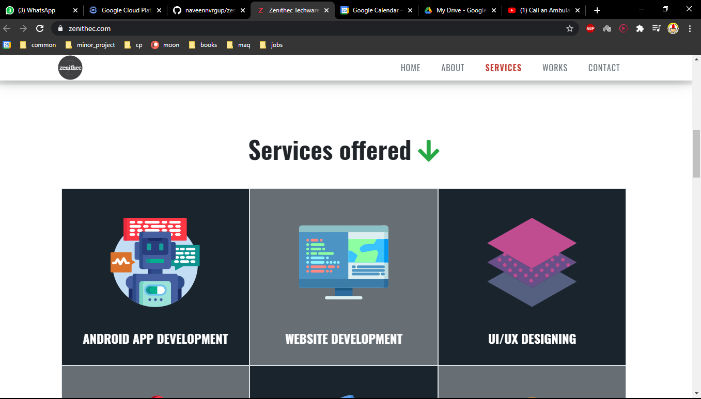
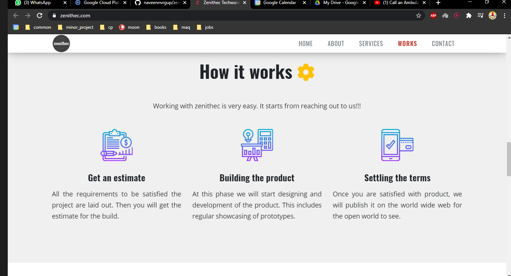
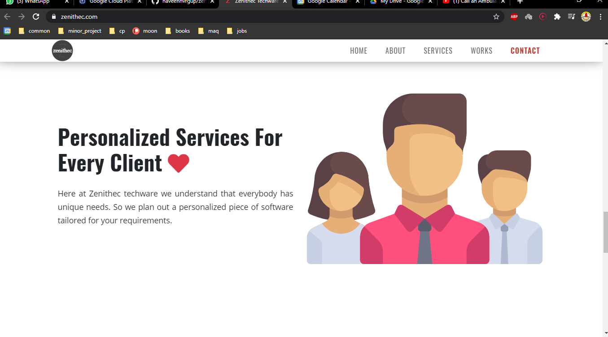
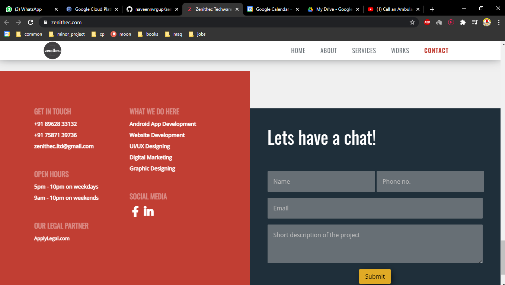

# Zenithec Website

This repo is current hosted in digitalocean droplet at [https://zenithec.com/](https://zenithec.com/).

This is the main site of Zenithec Techware.
Zenithec Techware(startup for startups) is a service based start-up with the motto 
of advancing the various start-ups having difficulty in starting their business online.

#### Backend technologies:
* Django
* nignx
* mysql

#### Frontend technolgies:
* pug/jade - templating engine
* SCSS
* Javascript
* parcel.js - used to bundle the pug, scss and js into html, css and vanilla js.

#### Screenshots

